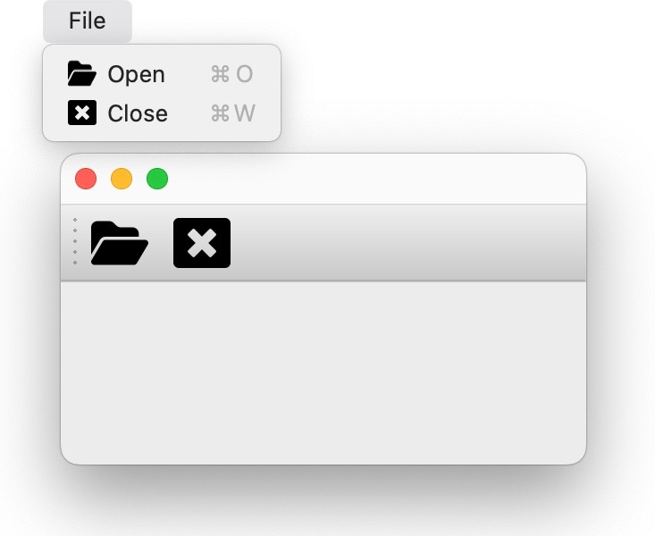

# Getting Started

## Creating an Application

Typical usage will begin by creating a [`Application`][app_model.Application]
object.

```python
from app_model import Application

my_app = Application('my-app')
```

## Registering Actions

Most applications will have some number of actions that can be invoked by the
user. Actions are typically callable objects that perform some operation, such
as "open a file", "save a file", "copy", "paste", etc.
These actions will usually be exposed in the application's menus and
toolbars, and will usually have associated keybindings.  Sometimes actions
hold state, such as "toggle word wrap" or "toggle line numbers".

`app-model` provides a high level [`Action`][app_model.Action] object that
comprises a pointer to a callable object, along with placement in menus, keybindings,
and additional metadata like title, icons, tooltips, etc...

```python
from app_model.types import Action, KeyBindingRule, KeyCode, KeyMod, MenuRule

def open_file():
    print('open file!')

def close_window():
    print('close window!')

ACTIONS: list[Action] = [
    Action(
        id='open',
        title="Open",
        icon="fa6-solid:folder-open",
        callback=open_file,
        menus=['File'],
        keybindings=[KeyBindingRule(primary=KeyMod.CtrlCmd | KeyCode.KeyO)],
    ),
    Action(
        id='close',
        title="Close",
        icon="fa-solid:window-close",
        callback=close_window,
        menus=['File'],
        keybindings=[KeyBindingRule(primary=KeyMod.CtrlCmd | KeyCode.KeyW)],
    ),
    # ...
]
```

Actions are registered with the application using the
[`Application.register_action()`][app_model.Application.register_action] method.

```python
for action in ACTIONS:
    my_app.register_action(action)
```

## Registries

The application maintains three internal registries.

1. `Application.commands` is an instance of
    [`CommandsRegistry`][app_model.registries.CommandsRegistry]. It maintains
    all of the commands (the actual callable object) that have been registered with
    the application.
2. `Application.menus` is an instance of
    [`MenusRegistry`][app_model.registries.MenusRegistry]. It maintains all of
    the menus and submenu items that have been registered with the application.
3. `Application.keybindings` is an instance of
    [`KeyBindingsRegistry`][app_model.registries.KeyBindingsRegistry]. It maintains
    an association between a [KeyBinding][app_model.types.KeyBinding] and a command
    id in the `CommandsRegistry`.

!!! Note
    Calling [`Application.register_action`][app_model.Application.register_action] with a single
    [`Action`][app_model.Action] object is just a convenience around independently registering
    objects with each of the registries using:

    - [CommandsRegistry.register_command][app_model.registries.CommandsRegistry.register_command]
    - [MenusRegistry.append_menu_items][app_model.registries.MenusRegistry.append_menu_items]
    - [KeyBindingsRegistry.register_keybinding_rule][app_model.registries.KeyBindingsRegistry.register_keybinding_rule]

### Registry events

Each of these registries has a signal that is emitted when a new item is added.

- `CommandsRegistry.registered` is emitted with the new command id (`str`) whenever
  [`CommandsRegistry.register_command`][app_model.registries.CommandsRegistry.register_command]
  is called
- `MenusRegistry.menus_changed` is emitted with the new menu ids (`set[str]`) whenever
  [`MenusRegistry.append_menu_items`][app_model.registries.MenusRegistry.append_menu_items]
  or if the menu items have been disposed.
- `KeyBindingsRegistry.registered` is emitted (no arguments) whenever
  [`KeyBindingsRegistry.register_keybinding_rule`][app_model.registries.KeyBindingsRegistry.register_keybinding_rule] is called.

You can connect callbacks to these events to handle them as needed.

```python
@my_app.commands.registered.connect
def on_command_registered(command_id: str):
    print(f'Command {command_id!r} registered!')

my_app.commands.register_command('new-id', lambda: None, title='No-op')
# Command 'new-id' registered!
```

## Executing Commands

Registered commands may be executed on-demand using [`execute_command`][app_model.registries.CommandsRegistry.execute_command] method on the command registry:

```python
my_app.commands.execute_command('open')
# prints "open file!" from the `open_file` function registered above.
```

### Command Arguments and Dependency Injection

The `execute_command` function does accept `*args` and `**kwargs` that will
be passed to the command.  However, very often in a GUI application
you may wish to infer some of the arguments from the current state of the
application.  For example, if you have menu item linked to a "close window",
you likely want to close the current window. For this, `app-model` uses
a dependency injection pattern, provided by the
[`in-n-out`](https://github.com/pyapp-kit/in-n-out) library.

The application has a [`injection_store`][app_model.Application.injection_store]
attribute that is an instance of an `in_n_out.Store`.  A `Store` is a collection
of:

- **providers**: Functions that can be called to return an instance of a given
  type. These may be used to provide arguments to commands, based on the type
  annotations in the command function definition.
- **processors**: Functions that accept an instance of a given type and do
  something with it. These are used to process the return value of the command
  function at execution time, based on command definition return type annotations.

See [`in-n-out` getting started](https://ino.readthedocs.io/en/latest/getting_started/)
for more details on the use of providers/processos in the `Store`.

Here's a simple example.  Let's say an application has a `User` object with a `name()`
method:

```python
class User:
    def name(self):
        return 'John Doe'
```

Assume the application has some way of retrieving the current user:

```python
def get_current_user() -> User:
    # ... get the current user from somewhere
    return User()
```

We register this provider function with the application's injection store:

```python
my_app.injection_store.register_provider(get_current_user)
```

Now commands may be defined that accept a `User` argument, and used
for callbacks in actions registered with the application.

```python
def print_user_name(user: User) -> None:
    print(f"Hi {user.name()}!")

action = Action(
    id='greet',
    title="Greet Current User",
    callback=print_user_name,
)

my_app.register_action(action)
my_app.commands.execute_command('greet')
# prints "Hi John Doe!"
```

## Connecting a GUI framework

Of course, most of this is useless without some way to connect the application
to a GUI framework.  The [`app_model.backends`][app_model.backends] module
provides functions that map the `app-model` model onto various GUI framework models.

!!! note "erm... someday 😂"

    Well, really it's just Qt for now, but the abstraction is valuable for the
    ability to swap backends.  And we hope to add more backends if the demand is
    there.

### Qt

Currently, we don't have a generic abstraction for the application window, so
users are encouraged to directly use the classes in the `app_model.backends.qt`
module.  One of the main classes is the [`QModelMainWindow`][app_model.backends.qt.QModelMainWindow] object: a subclass of `QMainWindow` that knows how to map
an `Application` object onto the Qt model.

```python
from app_model.backends.qt import QModelMainWindow
from qtpy.QtWidgets import QApplication

app = QApplication([])

# create the main window with our app_model.Application
main = QModelMainWindow(my_app)

# pick menus for main menu bar,
# using menu ids from the application's MenusRegistry
main.setModelMenuBar(['File'])

# add toolbars using menu ids from the application's MenusRegistry
# here we re-use the File menu ... but you can have menus
# dedicated for toolbars, or just exclude items from the menu
main.addModelToolBar('File')
main.show()

app.exec_()
```

You should now have a QMainWindow with a menu bar and toolbar populated with
the actions you registered with the application with icons, keybindings,
and callbacks all connected.



Once objects have been registered with the application, it becomes very easy to
create Qt objects (such as
[`QMainWindow`](https://doc.qt.io/qt-6/qmainwindow.html),
[`QMenu`](https://doc.qt.io/qt-6/qmenu.html),
[`QMenuBar`](https://doc.qt.io/qt-6/qmenubar.html),
[`QAction`](https://doc.qt.io/qt-6/qaction.html),
[`QToolBar`](https://doc.qt.io/qt-6/qtoolbar.html), etc...) with very minimal
boilerplate and repetitive procedural code.

See all objects in the [Qt backend API docs][app_model.backends.qt].

!!! Tip

    Application registries are backed by
    [psygnal](https://github.com/pyapp-kit/psygnal), and emit events when modified.
    These events are connected to the Qt objects, so `QModel...` objects such as
    `QModelMenu` and `QCommandAction` will be updated when the application's
    registry is updated.
